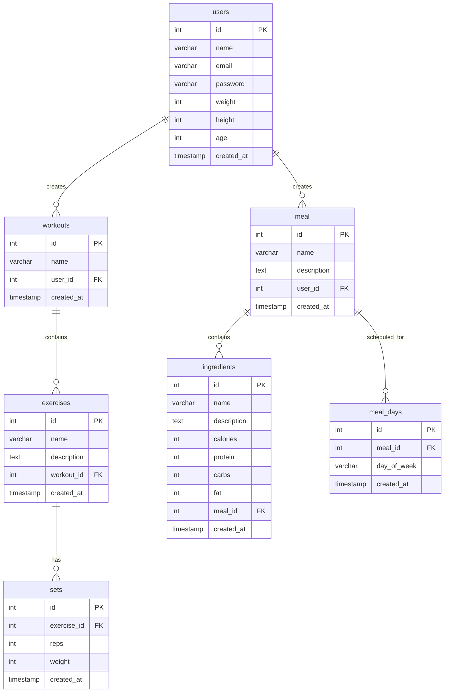

# Faitness Database Schema

This document describes the database schema for the Faitness application, a fitness and nutrition tracking system.

## Database Relationship Diagram

## Table Descriptions

### Users Table

Stores basic user information and physical characteristics.

**Key Fields:**

- `id`: Primary key (SERIAL)
- `name`: User's full name
- `email`: Unique email address for login
- `password`: User's password
- `weight`: User's weight in kilograms
- `height`: User's height in centimeters
- `age`: User's age in years
- `created_at`: Account creation timestamp

### Workouts Table

Represents workout sessions created by users.

**Key Fields:**

- `id`: Primary key (SERIAL)
- `name`: Workout name/title
- `user_id`: Foreign key referencing users table
- `created_at`: Workout creation timestamp

**Relationships:**

- Belongs to one user (many-to-one with users)
- Contains multiple exercises (one-to-many with exercises)

### Exercises Table

Individual exercises within a workout session.

**Key Fields:**

- `id`: Primary key (SERIAL)
- `name`: Exercise name
- `description`: Detailed exercise description
- `workout_id`: Foreign key referencing workouts table
- `created_at`: Exercise creation timestamp

**Relationships:**

- Belongs to one workout (many-to-one with workouts)
- Has multiple sets (one-to-many with sets)

### Sets Table

Individual sets performed for each exercise.

**Key Fields:**

- `id`: Primary key (SERIAL)
- `exercise_id`: Foreign key referencing exercises table
- `reps`: Number of repetitions performed
- `weight`: Weight used in kilograms
- `created_at`: Set creation timestamp

**Relationships:**

- Belongs to one exercise (many-to-one with exercises)

### Meal Table

User-created meal recipes.

**Key Fields:**

- `id`: Primary key (SERIAL)
- `name`: Meal name
- `description`: Meal description
- `user_id`: Foreign key referencing users table
- `created_at`: Meal creation timestamp

**Relationships:**

- Belongs to one user (many-to-one with users)
- Contains multiple ingredients (one-to-many with ingredients)
- Can be scheduled for multiple days (one-to-many with meal_days)

### Ingredients Table

Ingredients that compose meals with their nutritional information.

**Key Fields:**

- `id`: Primary key (SERIAL)
- `name`: Ingredient name
- `description`: Ingredient description
- `calories`: Caloric content
- `protein`: Protein content in grams
- `carbs`: Carbohydrate content in grams
- `fat`: Fat content in grams
- `meal_id`: Foreign key referencing meal table
- `created_at`: Ingredient creation timestamp

**Relationships:**

- Belongs to one meal (many-to-one with meal)

### Meal Days Table

Scheduling system for meals across different days of the week.

**Key Fields:**

- `id`: Primary key (SERIAL)
- `meal_id`: Foreign key referencing meal table
- `day_of_week`: Day of the week (enum: monday, tuesday, wednesday, thursday, friday, saturday, sunday)
- `created_at`: Schedule creation timestamp

**Constraints:**

- Unique constraint on (meal_id, day_of_week) - prevents duplicate meal scheduling for the same day
- Check constraint ensures day_of_week is valid

**Relationships:**

- Belongs to one meal (many-to-one with meal)

## Key Relationships

1. **Users → Workouts**: One-to-many relationship where each user can create multiple workouts
2. **Users → Meals**: One-to-many relationship where each user can create multiple meal recipes
3. **Workouts → Exercises**: One-to-many relationship where each workout contains multiple exercises
4. **Exercises → Sets**: One-to-many relationship where each exercise has multiple sets
5. **Meals → Ingredients**: One-to-many relationship where each meal contains multiple ingredients
6. **Meals → Meal Days**: One-to-many relationship where each meal can be scheduled for multiple days

## Database Features

- **Cascade Deletion**: All foreign key relationships use `ON DELETE CASCADE` to maintain referential integrity
- **Unique Constraints**: Email addresses are unique, and meals cannot be scheduled twice for the same day
- **Data Validation**: Day of week values are validated using CHECK constraints
- **Audit Trail**: All tables include `created_at` timestamps for tracking record creation
- **Hierarchical Structure**: Clear parent-child relationships between users, workouts, exercises, and sets
- **Flexible Meal Planning**: Meals can be scheduled for specific days of the week with nutritional tracking

This schema supports a complete fitness tracking application with workout logging, exercise management, meal planning, and nutritional monitoring capabilities.
